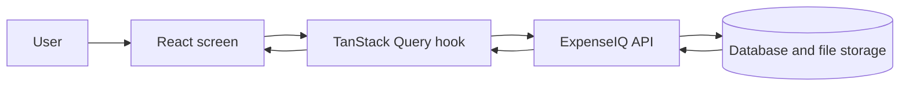
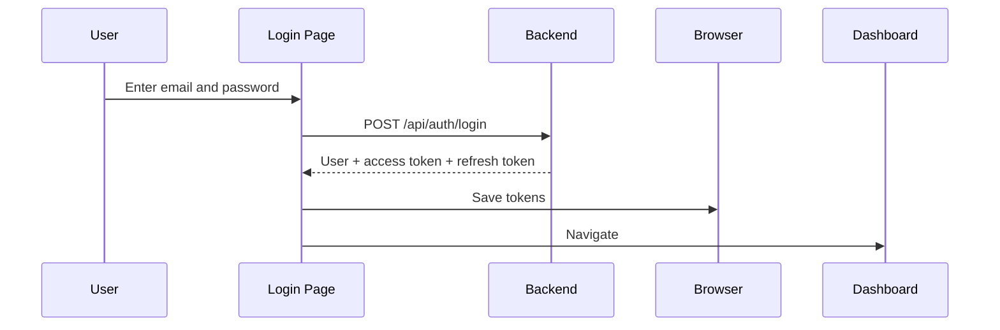
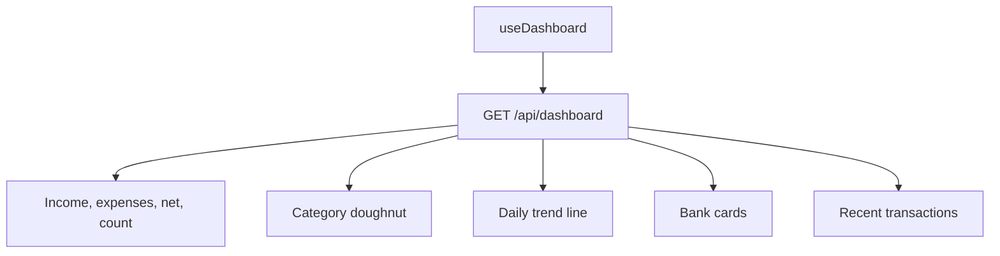
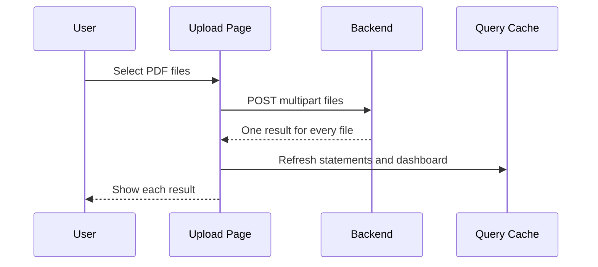
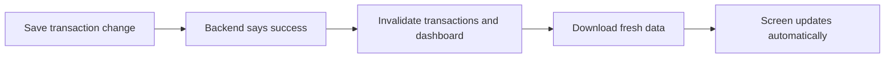

# ExpenseIQ Beginner Frontend Guide

This guide explains how to connect the ExpenseIQ design to the backend using React and TanStack Query. It uses plain functions and plain objects. There are no classes or constructors.

## 1. The simple idea

The frontend has three jobs:

1. Show screens and forms.
2. Ask the backend for data.
3. Show loading, success, empty, and error states.

The backend handles passwords, bank statement files, transactions, ownership, and financial calculations.



Think of TanStack Query as a helpful assistant between the screen and the backend. It remembers downloaded data, tells the screen when it is loading, and downloads fresh data after changes.

## 2. How the design connects to the API

| Screen in the design | What the screen needs                     | API call                             |
| -------------------- | ----------------------------------------- | ------------------------------------ |
| Login                | Sign the user in                          | `POST /api/auth/login`               |
| Register             | Create an account                         | `POST /api/auth/register`            |
| Dashboard            | Cards, charts, banks, recent transactions | `GET /api/dashboard`                 |
| Upload Statements    | Send PDF files                            | `POST /api/statements/upload`        |
| Statements           | Show uploaded statements                  | `GET /api/statements`                |
| Select Bank          | Tell backend which bank owns a statement  | `POST /api/statements/:id/reprocess` |
| Review Center        | Show and filter transactions              | `GET /api/transactions`              |
| Review Transaction   | Save a correction                         | `PATCH /api/transactions/:id`        |
| Categories           | Get category names                        | `GET /api/categories`                |

## 3. Create the React project

```bash
npm create vite@latest expenseiq-frontend -- --template react-ts
cd expenseiq-frontend
npm install
npm install @tanstack/react-query react-router-dom
npm run dev
```

Create `.env`:

```env
VITE_API_URL=http://localhost:4000
```

When the backend is deployed, change it to the Render address:

```env
VITE_API_URL=https://expenseiq-backend-iglc.onrender.com
```

Restart the frontend after changing `.env`.

## 4. Beginner-friendly folders

```text
src/
  api/
    api.js
  hooks/
    useAuth.js
    useDashboard.js
    useStatements.js
    useTransactions.js
  pages/
    LoginPage.jsx
    DashboardPage.jsx
    UploadPage.jsx
    StatementsPage.jsx
    TransactionsPage.jsx
  components/
    LoadingMessage.jsx
    ErrorMessage.jsx
    EmptyMessage.jsx
  App.jsx
  main.jsx
```

Start with JavaScript files if TypeScript feels distracting. Types can be added later without changing the API flow.

## 5. Add TanStack Query

In `src/main.jsx`:

```jsx
import React from 'react';
import ReactDOM from 'react-dom/client';
import { QueryClient, QueryClientProvider } from '@tanstack/react-query';
import App from './App';

const queryClient = new QueryClient();

ReactDOM.createRoot(document.getElementById('root')).render(
  <React.StrictMode>
    <QueryClientProvider client={queryClient}>
      <App />
    </QueryClientProvider>
  </React.StrictMode>,
);
```

`QueryClientProvider` makes TanStack Query available to every page.

## 6. Create one simple API helper

Create `src/api/api.js`:

```js
const API_URL = import.meta.env.VITE_API_URL;

export function saveTokens(accessToken, refreshToken) {
  sessionStorage.setItem('accessToken', accessToken);
  sessionStorage.setItem('refreshToken', refreshToken);
}

export function clearTokens() {
  sessionStorage.removeItem('accessToken');
  sessionStorage.removeItem('refreshToken');
}

export async function refreshLogin() {
  const refreshToken = sessionStorage.getItem('refreshToken');
  if (!refreshToken) return false;

  const response = await fetch(`${API_URL}/api/auth/refresh`, {
    method: 'POST',
    headers: { 'Content-Type': 'application/json' },
    body: JSON.stringify({ refreshToken }),
  });

  if (!response.ok) {
    clearTokens();
    return false;
  }

  const result = await response.json();
  saveTokens(result.data.token, result.data.refreshToken);
  return true;
}

export async function apiRequest(path, options = {}, retryAfterRefresh = true) {
  const accessToken = sessionStorage.getItem('accessToken');
  const headers = { ...options.headers };

  if (!(options.body instanceof FormData)) {
    headers['Content-Type'] = 'application/json';
  }

  if (accessToken) {
    headers.Authorization = `Bearer ${accessToken}`;
  }

  let response = await fetch(`${API_URL}${path}`, { ...options, headers });

  if (response.status === 401 && retryAfterRefresh) {
    const refreshed = await refreshLogin();
    if (refreshed) {
      return apiRequest(path, options, false);
    }
  }

  if (response.status === 204) return null;

  const result = await response.json();
  if (!response.ok) {
    throw result.error || { message: 'Something went wrong.' };
  }

  return result;
}
```

Important: never set `Content-Type` yourself when sending `FormData`. The browser creates the correct multipart boundary.

## 7. Login screen



Create `src/hooks/useAuth.js`:

```js
import { useMutation, useQuery, useQueryClient } from '@tanstack/react-query';
import { apiRequest, clearTokens, saveTokens } from '../api/api';

export function useLogin() {
  const queryClient = useQueryClient();

  return useMutation({
    mutationFn: async ({ email, password }) => {
      return apiRequest(
        '/api/auth/login',
        {
          method: 'POST',
          body: JSON.stringify({ email, password }),
        },
        false,
      );
    },
    onSuccess: (result) => {
      saveTokens(result.data.token, result.data.refreshToken);
      queryClient.setQueryData(['currentUser'], result.data.user);
    },
  });
}

export function useCurrentUser() {
  return useQuery({
    queryKey: ['currentUser'],
    queryFn: async () => {
      const result = await apiRequest('/api/auth/me');
      return result.data;
    },
  });
}

export function useLogout() {
  const queryClient = useQueryClient();

  return useMutation({
    mutationFn: async () => {
      const refreshToken = sessionStorage.getItem('refreshToken');
      return apiRequest('/api/auth/logout', {
        method: 'POST',
        body: JSON.stringify({ refreshToken }),
      });
    },
    onSettled: () => {
      clearTokens();
      queryClient.clear();
    },
  });
}
```

Use it in `LoginPage.jsx`:

```jsx
function LoginPage() {
  const login = useLogin();
  const navigate = useNavigate();

  function submit(event) {
    event.preventDefault();
    const form = new FormData(event.currentTarget);

    login.mutate(
      {
        email: form.get('email'),
        password: form.get('password'),
      },
      {
        onSuccess: () => navigate('/dashboard'),
      },
    );
  }

  return (
    <form onSubmit={submit}>
      <input name="email" type="email" placeholder="Email" required />
      <input name="password" type="password" placeholder="Password" required />
      <button disabled={login.isPending}>{login.isPending ? 'Signing in...' : 'Login'}</button>
      {login.isError && <p>{login.error.message}</p>}
    </form>
  );
}
```

## 8. Dashboard screen

The dashboard needs only one main API call. The backend already calculates the totals and chart values.



Create `src/hooks/useDashboard.js`:

```js
import { useQuery } from '@tanstack/react-query';
import { apiRequest } from '../api/api';

export function useDashboard() {
  return useQuery({
    queryKey: ['dashboard'],
    queryFn: async () => {
      const result = await apiRequest('/api/dashboard');
      return result.data;
    },
  });
}
```

Use it in `DashboardPage.jsx`:

```jsx
function DashboardPage() {
  const dashboard = useDashboard();

  if (dashboard.isPending) return <p>Loading your dashboard...</p>;
  if (dashboard.isError) return <p>Could not load the dashboard.</p>;
  if (dashboard.data.transactionCount === 0) {
    return <p>Upload a statement to see your financial overview.</p>;
  }

  const data = dashboard.data;

  return (
    <main>
      <section className="cards">
        <MetricCard title="Total Income" value={formatNaira(data.totalIncomeMinor)} />
        <MetricCard title="Total Expenses" value={formatNaira(data.totalExpensesMinor)} />
        <MetricCard title="Net Income" value={formatNaira(data.netCashFlowMinor)} />
        <MetricCard title="Transactions" value={data.transactionCount} />
      </section>

      <CategoryChart rows={data.spendingByCategory} />
      <TrendChart rows={data.spendingTrend} />
      <BankCards rows={data.spendingByBank} />
      <RecentTransactions rows={data.recentTransactions} />
    </main>
  );
}
```

Format money only when showing it:

```js
export function formatNaira(amountMinor) {
  return new Intl.NumberFormat('en-NG', {
    style: 'currency',
    currency: 'NGN',
  }).format(amountMinor / 100);
}
```

`100000` means `₦1,000.00`. Do not change backend money values into floating-point values before calculations.

## 9. Upload Statements screen



Create `src/hooks/useStatements.js`:

```js
import { useMutation, useQuery, useQueryClient } from '@tanstack/react-query';
import { apiRequest } from '../api/api';

export function useUploadStatements() {
  const queryClient = useQueryClient();

  return useMutation({
    mutationFn: async (files) => {
      const body = new FormData();
      files.forEach((file) => body.append('files', file));

      return apiRequest('/api/statements/upload', {
        method: 'POST',
        body,
      });
    },
    onSuccess: () => {
      queryClient.invalidateQueries({ queryKey: ['statements'] });
      queryClient.invalidateQueries({ queryKey: ['transactions'] });
      queryClient.invalidateQueries({ queryKey: ['dashboard'] });
    },
  });
}

export function useStatements(page) {
  return useQuery({
    queryKey: ['statements', page],
    queryFn: () => apiRequest(`/api/statements?page=${page}&pageSize=20`),
  });
}
```

Upload result meanings:

| Status       | What to show                               |
| ------------ | ------------------------------------------ |
| `PROCESSED`  | Green success state                        |
| `NEEDS_BANK` | Orange state and Select Bank button        |
| `DUPLICATE`  | Explain that the file was already uploaded |
| `FAILED`     | Red state and backend error message        |

The upload endpoint returns HTTP 207 because some files may succeed while another fails. HTTP 207 is a successful response. Always loop through `result.data.items`.

## 10. Statements screen

```jsx
function StatementsPage() {
  const [page, setPage] = useState(1);
  const statements = useStatements(page);

  if (statements.isPending) return <p>Loading statements...</p>;
  if (statements.isError) return <p>Could not load statements.</p>;
  if (statements.data.data.length === 0) return <p>No statements uploaded yet.</p>;

  return (
    <>
      <StatementTable rows={statements.data.data} />
      <Pagination page={page} total={statements.data.meta.total} pageSize={20} onChange={setPage} />
    </>
  );
}
```

After selecting a bank, call:

```js
apiRequest(`/api/statements/${statementId}/reprocess`, {
  method: 'POST',
  body: JSON.stringify({ bankCode: 'GTBANK' }),
});
```

Then refresh these three simple query groups:

```js
queryClient.invalidateQueries({ queryKey: ['statements'] });
queryClient.invalidateQueries({ queryKey: ['transactions'] });
queryClient.invalidateQueries({ queryKey: ['dashboard'] });
```

## 11. Review Center screen

Create `src/hooks/useTransactions.js`:

```js
import { useMutation, useQuery, useQueryClient } from '@tanstack/react-query';
import { apiRequest } from '../api/api';

export function useTransactions(filters) {
  const search = new URLSearchParams(filters).toString();

  return useQuery({
    queryKey: ['transactions', filters],
    queryFn: () => apiRequest(`/api/transactions?${search}`),
  });
}

export function useUpdateTransaction() {
  const queryClient = useQueryClient();

  return useMutation({
    mutationFn: ({ transactionId, changes }) => {
      return apiRequest(`/api/transactions/${transactionId}`, {
        method: 'PATCH',
        body: JSON.stringify(changes),
      });
    },
    onSuccess: () => {
      queryClient.invalidateQueries({ queryKey: ['transactions'] });
      queryClient.invalidateQueries({ queryKey: ['dashboard'] });
    },
  });
}
```

The review modal can change:

- date;
- description;
- amount in minor units;
- income/expense type;
- category.

Reset the page to 1 whenever filters change. Wait about 400 milliseconds after typing before sending the search request.

## 12. What “invalidate” means

Invalidating means: “TanStack Query, this saved data may now be old. Please download it again.”



| User action           | Queries to refresh                  |
| --------------------- | ----------------------------------- |
| Upload statement      | statements, transactions, dashboard |
| Select bank/reprocess | statements, transactions, dashboard |
| Delete statement      | statements, transactions, dashboard |
| Correct transaction   | transactions, dashboard             |
| Logout                | clear all queries                   |

## 13. Loading, empty, error, and success

Every page must answer four questions:

1. Is it loading?
2. Did it fail?
3. Is the returned list empty?
4. Is there data to display?

Use this easy pattern:

```jsx
if (query.isPending) return <LoadingMessage />;
if (query.isError) return <ErrorMessage message="Please try again." />;
if (query.data.data.length === 0) return <EmptyMessage />;
return <TheRealScreen data={query.data.data} />;
```

For buttons:

```jsx
<button disabled={save.isPending}>{save.isPending ? 'Saving...' : 'Save Changes'}</button>
```

## 14. Desktop and mobile design

The API code does not change between desktop and mobile.

- Desktop: permanent sidebar, four metric cards, charts side by side, transaction table.
- Mobile: menu button/drawer, stacked cards, full-width charts, transaction cards instead of a wide table.
- Upload: desktop drag-and-drop area; mobile file picker button.
- Review form: desktop modal; mobile full-screen sheet.

Use the same hooks on both layouts.

## 15. Important current limitations

- Manual bank selection supports Access, Fidelity, FirstBank, GTBank, and Zenith. The design image shows UBA, but UBA is not implemented yet.
- Dashboard date-range controls are not implemented by the backend yet.
- Review-status filtering is not implemented yet.
- Reliable PDF transaction extraction still needs parser work and anonymized text-PDF samples.
- Do not show Reports or Settings as completed features until their APIs exist.

## 16. Build the frontend in this order

1. Start the backend and confirm `/health/ready`.
2. Add `QueryClientProvider`.
3. Add `api.js`.
4. Build login and registration.
5. Build the protected page layout and logout.
6. Build the dashboard cards and empty state.
7. Add dashboard charts.
8. Build statement upload and show each file result.
9. Build the statements table and bank-selection dialog.
10. Build transaction filters and the review form.
11. Add mobile layouts.
12. Test expired login, errors, empty lists, upload failures, and corrections.

## 17. Quick testing checklist

- Login saves both tokens.
- Reloading the page calls `/api/auth/me`.
- An expired access token refreshes once and retries the request.
- Failed refresh returns the user to login.
- Dashboard money divides minor units by 100 only for display.
- Upload shows every file result from HTTP 207.
- Selecting a bank refreshes statements, transactions, and dashboard.
- Saving a transaction refreshes the table and dashboard.
- Pagination uses `meta.total`.
- Every page has loading, error, empty, and success states.
- No backend secret is placed in frontend `.env`.
