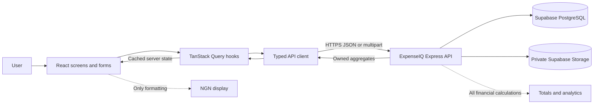
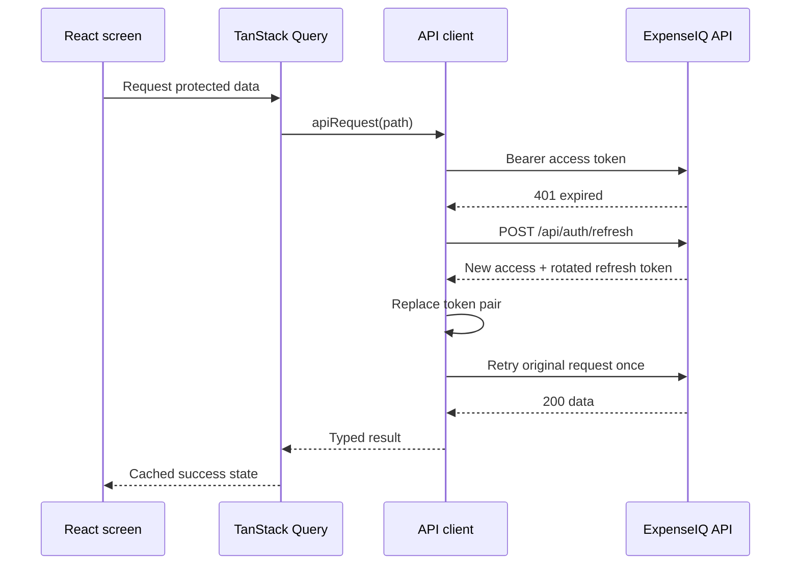
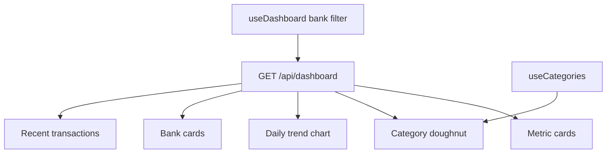
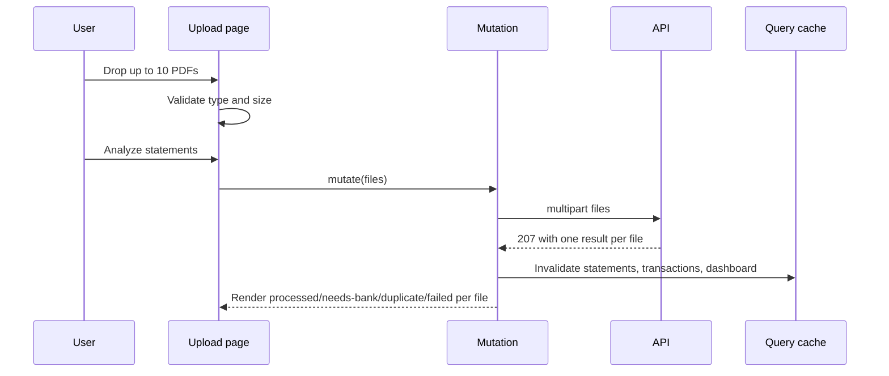

# ExpenseIQ Frontend + TanStack Query Implementation Guide

This document maps the supplied ExpenseIQ desktop/mobile design to the deployed API. It assumes React, TypeScript, React Router, TanStack Query v5, React Hook Form, Zod, Tailwind CSS, and Recharts.

## 1. What belongs where



React owns presentation state: open modals, selected files, form values, active tabs, and navigation. TanStack Query owns remote server state. The backend owns identity, authorization, statement files, transactions, and all financial calculations.

Never parse PDFs, calculate authoritative dashboard totals, or trust a browser-supplied user ID in the frontend.

## 2. Design-to-API map

| Design area        | API/query                                              | UI behavior                                                            |
| ------------------ | ------------------------------------------------------ | ---------------------------------------------------------------------- |
| Login/register     | `POST /api/auth/login`, `POST /api/auth/register`      | Store returned access/refresh pair; navigate to dashboard              |
| App user/footer    | `GET /api/auth/me`                                     | Show name/email; controls protected layout                             |
| Dashboard cards    | `GET /api/dashboard`                                   | Income, expenses, net flow, transaction count                          |
| Category doughnut  | `dashboard.spendingByCategory` + `GET /api/categories` | Join category ID to label/color                                        |
| Spending trend     | `dashboard.spendingTrend`                              | Recharts line/area chart ordered by date                               |
| Spending by bank   | `dashboard.spendingByBank`                             | Bank cards/bars ordered by expenses                                    |
| Recent activity    | `dashboard.recentTransactions`                         | Five newest transactions                                               |
| Upload drop zone   | `POST /api/statements/upload`                          | One multipart batch; display every per-file result from HTTP 207       |
| Detection results  | Upload response                                        | Processed, needs-bank, duplicate, and failed status cards              |
| Statement table    | `GET /api/statements`                                  | Paginated history; status tabs can be client-side on current page only |
| Select bank action | `POST /api/statements/:id/reprocess`                   | Bank modal, then invalidate related queries                            |
| Delete statement   | `DELETE /api/statements/:id`                           | Confirmation dialog, then refresh statements/transactions/dashboard    |
| Review table       | `GET /api/transactions`                                | Server bank/category/type/search filters and pagination                |
| Review modal       | `PATCH /api/transactions/:id`                          | Edit supported fields and refresh analytics                            |
| Category selector  | `GET /api/categories`                                  | Stable options cached for the session                                  |

Current design gaps must be handled honestly:

- The mockup shows UBA, but the backend currently supports `ACCESS`, `FIDELITY`, `FIRSTBANK`, `GTBANK`, and `ZENITH` for manual bank selection.
- Dashboard date-range/monthly controls are not yet API filters; hide or disable them until implemented.
- Review-status filtering is not yet supported by `GET /api/transactions`; do not label a client-only current-page filter as global.
- Reliable PDF transaction extraction is not complete, so production dashboard values remain empty until transactions are persisted.
- Reports, settings, and category administration are not complete CRUD features.

## 3. Frontend structure

```text
src/
  app/
    App.tsx
    router.tsx
    query-client.ts
  api/
    client.ts
    contracts.ts
    query-keys.ts
  auth/
    auth.api.ts
    auth.hooks.ts
    AuthBootstrap.tsx
    ProtectedLayout.tsx
  dashboard/
    dashboard.api.ts
    dashboard.hooks.ts
    DashboardPage.tsx
    MetricCards.tsx
    CategoryChart.tsx
    TrendChart.tsx
    BankBreakdown.tsx
  statements/
    statements.api.ts
    statements.hooks.ts
    UploadPage.tsx
    StatementsPage.tsx
    BankSelectionDialog.tsx
  transactions/
    transactions.api.ts
    transactions.hooks.ts
    ReviewPage.tsx
    ReviewTransactionDialog.tsx
  categories/
    categories.api.ts
    categories.hooks.ts
  shared/
    ErrorState.tsx
    LoadingSkeleton.tsx
    EmptyState.tsx
    money.ts
```

## 4. Install and configure

```bash
pnpm add @tanstack/react-query @tanstack/react-query-devtools react-router-dom
pnpm add react-hook-form zod @hookform/resolvers recharts
```

```env
VITE_API_URL=http://localhost:4000
```

Production uses the Render origin, without a trailing slash. The backend `CORS_ORIGIN` must equal the frontend origin.

## 5. Query client

```ts
// src/app/query-client.ts
import { QueryClient } from '@tanstack/react-query';

export const queryClient = new QueryClient({
  defaultOptions: {
    queries: {
      staleTime: 30_000,
      gcTime: 10 * 60_000,
      retry: (failureCount, error) => {
        const status = (error as { status?: number }).status;
        if (status && status >= 400 && status < 500) return false;
        return failureCount < 2;
      },
      refetchOnWindowFocus: true,
    },
    mutations: { retry: false },
  },
});
```

```tsx
// src/main.tsx
import { QueryClientProvider } from '@tanstack/react-query';
import { ReactQueryDevtools } from '@tanstack/react-query-devtools';
import { queryClient } from './app/query-client';

createRoot(document.getElementById('root')!).render(
  <QueryClientProvider client={queryClient}>
    <App />
    {import.meta.env.DEV && <ReactQueryDevtools initialIsOpen={false} />}
  </QueryClientProvider>,
);
```

## 6. Query-key factory

Central keys make invalidation predictable.

```ts
// src/api/query-keys.ts
export const authKeys = {
  all: ['auth'] as const,
  me: () => [...authKeys.all, 'me'] as const,
};

export const statementKeys = {
  all: ['statements'] as const,
  lists: () => [...statementKeys.all, 'list'] as const,
  list: (page: number, pageSize: number) => [...statementKeys.lists(), { page, pageSize }] as const,
  details: () => [...statementKeys.all, 'detail'] as const,
  detail: (id: string) => [...statementKeys.details(), id] as const,
};

export const transactionKeys = {
  all: ['transactions'] as const,
  list: (filters: TransactionFilters) => [...transactionKeys.all, 'list', filters] as const,
};

export const categoryKeys = {
  all: ['categories'] as const,
};

export const dashboardKeys = {
  all: ['dashboard'] as const,
  summary: (bank?: BankCode) => [...dashboardKeys.all, { bank }] as const,
};
```

Create filter objects from primitive/debounced state and keep them serializable. Do not place `File`, functions, DOM objects, or class instances in query keys.

## 7. API client with one refresh and one retry



The backend rotates refresh tokens. Therefore all concurrent 401s must share one refresh promise.

```ts
// src/api/client.ts
const API_URL = import.meta.env.VITE_API_URL as string;
const ACCESS_KEY = 'expenseiq_access_token';
const REFRESH_KEY = 'expenseiq_refresh_token';

export class ApiError extends Error {
  constructor(
    public status: number,
    public code: string,
    message: string,
    public fieldErrors?: Record<string, string[]>,
  ) {
    super(message);
  }
}

export const tokens = {
  access: () => sessionStorage.getItem(ACCESS_KEY),
  refresh: () => sessionStorage.getItem(REFRESH_KEY),
  set: (access: string, refresh: string) => {
    sessionStorage.setItem(ACCESS_KEY, access);
    sessionStorage.setItem(REFRESH_KEY, refresh);
  },
  clear: () => {
    sessionStorage.removeItem(ACCESS_KEY);
    sessionStorage.removeItem(REFRESH_KEY);
  },
};

type AuthPayload = {
  data: { user: User; token: string; refreshToken: string };
};

let refreshInFlight: Promise<void> | null = null;

async function rotateTokens(): Promise<void> {
  const refreshToken = tokens.refresh();
  if (!refreshToken) throw new Error('No refresh token');
  const response = await fetch(`${API_URL}/api/auth/refresh`, {
    method: 'POST',
    headers: { 'Content-Type': 'application/json', Accept: 'application/json' },
    body: JSON.stringify({ refreshToken }),
  });
  if (!response.ok) throw new Error('Refresh rejected');
  const payload = (await response.json()) as AuthPayload;
  tokens.set(payload.data.token, payload.data.refreshToken);
}

async function send(path: string, init: RequestInit): Promise<Response> {
  const headers = new Headers(init.headers);
  headers.set('Accept', 'application/json');
  if (init.body && !(init.body instanceof FormData))
    headers.set('Content-Type', 'application/json');
  const access = tokens.access();
  if (access) headers.set('Authorization', `Bearer ${access}`);
  return fetch(`${API_URL}${path}`, { ...init, headers });
}

export async function apiRequest<T>(
  path: string,
  init: RequestInit = {},
  allowRefresh = true,
): Promise<T> {
  let response: Response;
  try {
    response = await send(path, init);
  } catch {
    throw new ApiError(0, 'NETWORK_ERROR', 'Unable to reach the ExpenseIQ server.');
  }

  if (response.status === 401 && allowRefresh && path !== '/api/auth/refresh' && tokens.refresh()) {
    try {
      refreshInFlight ??= rotateTokens().finally(() => {
        refreshInFlight = null;
      });
      await refreshInFlight;
      response = await send(path, init);
    } catch {
      tokens.clear();
      throw new ApiError(401, 'SESSION_EXPIRED', 'Your session has expired.');
    }
  }

  if (response.status === 204) return undefined as T;
  const payload = await response.json().catch(() => null);
  if (!response.ok) {
    const error = payload?.error;
    if (response.status === 401) tokens.clear();
    throw new ApiError(
      response.status,
      error?.code ?? 'HTTP_ERROR',
      error?.message ?? 'The request failed.',
      error?.fieldErrors,
    );
  }
  return payload as T;
}
```

For stronger production security, migrate refresh tokens to Secure, HttpOnly, SameSite cookies. The current API returns the token in JSON, so `sessionStorage` is the documented interim client model.

## 8. Authentication hooks and protected layout

```ts
export function useCurrentUser() {
  return useQuery({
    queryKey: authKeys.me(),
    queryFn: () => apiRequest<{ data: User }>('/api/auth/me').then((x) => x.data),
    enabled: Boolean(tokens.access() || tokens.refresh()),
    staleTime: 5 * 60_000,
    retry: false,
  });
}

export function useLogin() {
  const client = useQueryClient();
  return useMutation({
    mutationFn: (input: { email: string; password: string }) =>
      apiRequest<AuthPayload>(
        '/api/auth/login',
        {
          method: 'POST',
          body: JSON.stringify(input),
        },
        false,
      ),
    onSuccess: ({ data }) => {
      tokens.set(data.token, data.refreshToken);
      client.setQueryData(authKeys.me(), data.user);
    },
  });
}

export function useLogout() {
  const client = useQueryClient();
  return useMutation({
    mutationFn: () =>
      apiRequest<void>('/api/auth/logout', {
        method: 'POST',
        body: JSON.stringify({ refreshToken: tokens.refresh() }),
      }),
    onSettled: () => {
      tokens.clear();
      client.clear();
    },
  });
}
```

```tsx
function ProtectedLayout() {
  const me = useCurrentUser();
  if (!tokens.access() && !tokens.refresh()) return <Navigate to="/login" replace />;
  if (me.isPending) return <AppShellSkeleton />;
  if (me.isError) return <Navigate to="/login" replace />;
  return (
    <AppShell user={me.data}>
      <Outlet />
    </AppShell>
  );
}
```

Do not render protected financial screens before identity restoration finishes.

## 9. Dashboard implementation



```ts
export function useDashboard(bank?: BankCode) {
  return useQuery({
    queryKey: dashboardKeys.summary(bank),
    queryFn: () =>
      apiRequest<{ data: Dashboard }>(
        `/api/dashboard${bank ? `?bank=${encodeURIComponent(bank)}` : ''}`,
      ).then((x) => x.data),
  });
}

export function useCategories() {
  return useQuery({
    queryKey: categoryKeys.all,
    queryFn: () => apiRequest<{ data: Category[] }>('/api/categories').then((x) => x.data),
    staleTime: Infinity,
  });
}
```

```tsx
function DashboardPage() {
  const [bank, setBank] = useState<BankCode | undefined>();
  const dashboard = useDashboard(bank);
  const categories = useCategories();

  if (dashboard.isPending || categories.isPending) return <DashboardSkeleton />;
  if (dashboard.isError || categories.isError)
    return <ErrorState onRetry={() => dashboard.refetch()} />;
  if (dashboard.data.transactionCount === 0)
    return <EmptyDashboard onUpload={() => navigate('/statements/upload')} />;

  return (
    <DashboardLayout>
      <BankFilter value={bank} onChange={setBank} />
      <MetricCards data={dashboard.data} />
      <CategoryChart rows={dashboard.data.spendingByCategory} categories={categories.data} />
      <TrendChart rows={dashboard.data.spendingTrend} />
      <BankBreakdown rows={dashboard.data.spendingByBank} />
      <RecentTransactions rows={dashboard.data.recentTransactions} />
    </DashboardLayout>
  );
}
```

Convert minor units only in labels/tooltips:

```ts
export const formatNaira = (minor: number) =>
  new Intl.NumberFormat('en-NG', { style: 'currency', currency: 'NGN' }).format(minor / 100);
```

Recharts consumes numeric minor-unit values directly. Use `formatter={(value) => formatNaira(Number(value))}` for axes/tooltips.

## 10. Upload flow



```ts
export function useUploadStatements() {
  const client = useQueryClient();
  return useMutation({
    mutationFn: async (files: File[]) => {
      const form = new FormData();
      files.forEach((file) => form.append('files', file));
      return apiRequest<UploadResult>('/api/statements/upload', {
        method: 'POST',
        body: form,
      });
    },
    onSuccess: async () => {
      await Promise.all([
        client.invalidateQueries({ queryKey: statementKeys.all }),
        client.invalidateQueries({ queryKey: transactionKeys.all }),
        client.invalidateQueries({ queryKey: dashboardKeys.all }),
      ]);
    },
  });
}
```

HTTP 207 is successful (`response.ok === true`). Render each `data.items` result independently. The design’s detection-results panel should not reduce the response to one global success toast.

## 11. Statement list, reprocess, and delete

```ts
export function useStatements(page: number, pageSize: number) {
  return useQuery({
    queryKey: statementKeys.list(page, pageSize),
    queryFn: () =>
      apiRequest<Paginated<Statement>>(`/api/statements?page=${page}&pageSize=${pageSize}`),
    placeholderData: (previous) => previous,
  });
}

export function useReprocessStatement() {
  const client = useQueryClient();
  return useMutation({
    mutationFn: ({ id, bankCode, confirmReplaceCorrections = false }: ReprocessInput) =>
      apiRequest<{ data: Statement }>(`/api/statements/${id}/reprocess`, {
        method: 'POST',
        body: JSON.stringify({ bankCode, confirmReplaceCorrections }),
      }),
    onSuccess: async (_result, variables) => {
      await Promise.all([
        client.invalidateQueries({ queryKey: statementKeys.all }),
        client.invalidateQueries({ queryKey: statementKeys.detail(variables.id) }),
        client.invalidateQueries({ queryKey: transactionKeys.all }),
        client.invalidateQueries({ queryKey: dashboardKeys.all }),
      ]);
    },
  });
}

export function useDeleteStatement() {
  const client = useQueryClient();
  return useMutation({
    mutationFn: (id: string) => apiRequest<void>(`/api/statements/${id}`, { method: 'DELETE' }),
    onSuccess: async () => {
      await Promise.all([
        client.invalidateQueries({ queryKey: statementKeys.all }),
        client.invalidateQueries({ queryKey: transactionKeys.all }),
        client.invalidateQueries({ queryKey: dashboardKeys.all }),
      ]);
    },
  });
}
```

For `409 REPROCESS_CONFIRMATION_REQUIRED`, open the warning dialog shown by the product language, then repeat with `confirmReplaceCorrections: true` only after confirmation.

## 12. Transaction review

```ts
export function useTransactions(filters: TransactionFilters) {
  const search = new URLSearchParams();
  Object.entries(filters).forEach(([key, value]) => {
    if (value !== undefined && value !== '') search.set(key, String(value));
  });
  return useQuery({
    queryKey: transactionKeys.list(filters),
    queryFn: () => apiRequest<Paginated<Transaction>>(`/api/transactions?${search}`),
    placeholderData: (previous) => previous,
  });
}

export function useUpdateTransaction() {
  const client = useQueryClient();
  return useMutation({
    mutationFn: ({ id, changes }: UpdateTransactionInput) =>
      apiRequest<{ data: Transaction }>(`/api/transactions/${id}`, {
        method: 'PATCH',
        body: JSON.stringify(changes),
      }),
    onSuccess: async () => {
      await Promise.all([
        client.invalidateQueries({ queryKey: transactionKeys.all }),
        client.invalidateQueries({ queryKey: dashboardKeys.all }),
      ]);
    },
  });
}
```

Debounce description search by 300–500 ms. Reset page to 1 whenever bank, category, type, or search changes. Use API `meta.total`, not the current array length, for pagination.

The review modal sends only changed fields:

```json
{
  "date": "2026-08-13",
  "description": "TRF/JOHN DOE",
  "amountMinor": 500000,
  "type": "EXPENSE",
  "categoryId": "TRANSFER"
}
```

An amount input displaying `₦5,000.00` must convert to `500000` before mutation.

## 13. Cache invalidation chart

| Successful mutation |      Auth | Statements | Transactions |  Dashboard | Categories |
| ------------------- | --------: | ---------: | -----------: | ---------: | ---------: |
| Register/login      |  Set `me` |          — |            — |          — |          — |
| Logout              | Clear all |  Clear all |    Clear all |  Clear all |  Clear all |
| Upload              |         — | Invalidate |   Invalidate | Invalidate |          — |
| Reprocess           |         — | Invalidate |   Invalidate | Invalidate |          — |
| Delete statement    |         — | Invalidate |   Invalidate | Invalidate |          — |
| Correct transaction |         — |          — |   Invalidate | Invalidate |          — |

Invalidation is preferred to manually updating multiple derived financial caches.

## 14. Screen state matrix

| Screen         | Loading              | Empty                      | Error                 | Mutation pending          | Success                   |
| -------------- | -------------------- | -------------------------- | --------------------- | ------------------------- | ------------------------- |
| Dashboard      | Card/chart skeletons | Upload call-to-action      | Retry panel           | N/A                       | Cards and charts          |
| Upload         | Initial drop zone    | No files selected          | Per-file/global error | Disable analyze; progress | Per-file result list      |
| Statements     | Table skeleton       | No statements + upload CTA | Retry row             | Disable affected action   | Paginated table           |
| Review         | Table/card skeleton  | No matching transactions   | Retry panel           | Disable save              | Updated row and dashboard |
| Login/register | Form ready           | N/A                        | Field/general errors  | Disable submit            | Redirect                  |

On mobile, use stacked metric cards, horizontally safe charts, transaction cards, and a drawer navigation. The data hooks remain identical; only presentation changes.

## 15. API response relationships

```mermaid
flowchart TD
    AUTH[Register or Login] --> PAIR[Access + Refresh pair]
    PAIR --> ME[Current user]
    ME --> APP[Protected application shell]
    APP --> UPLOAD[Upload statements]
    UPLOAD --> STMT[Statement history/status]
    STMT -->|Processed transactions| TX[Transaction review]
    TX -->|Owned aggregate input| DASH[Dashboard analytics]
    CAT[Categories] --> TX
    CAT --> DASH
    TX -->|Correction invalidates| DASH
    STMT -->|Delete/reprocess invalidates| TX
    STMT -->|Delete/reprocess invalidates| DASH
```



## 16. Error handling

- `400 VALIDATION_ERROR`: map `fieldErrors` to React Hook Form fields.
- `401`: perform one coordinated refresh; redirect only if refresh fails.
- `404`: show not found without implying another user owns the resource.
- `409 CONFLICT`: show duplicate email or other conflict message.
- `409 REPROCESS_CONFIRMATION_REQUIRED`: show explicit replacement warning.
- `413`: explain upload size limits.
- `207`: success transport status; inspect every file result.
- `5xx` or network error: retain safe UI state and offer retry.

Never branch on message text. Use HTTP status plus stable `error.code`.

## 17. End-to-end implementation order

1. Add provider, query client, contracts, query keys, and API client.
2. Implement registration/login, coordinated refresh, logout, and protected layout.
3. Implement categories and dashboard query; build cards and empty state first.
4. Add category, trend, and bank charts using backend aggregates.
5. Implement upload selection and per-file 207 results.
6. Implement statement history, bank selection, reprocessing confirmation, and deletion.
7. Implement transaction server filters, pagination, and review modal.
8. Connect mutation invalidation so the dashboard updates after every financial change.
9. Add responsive/mobile presentations and accessible dialogs.
10. Test expired-token concurrency, partial uploads, empty analytics, correction refresh, and destructive confirmations.

## 18. Acceptance tests

- One expired access token plus several simultaneous queries triggers exactly one refresh call.
- The rotated refresh token replaces the old token before any future refresh.
- A failed refresh clears credentials and returns to login.
- Dashboard cards equal backend totals and never recompute from the five recent rows.
- Chart labels format minor units without changing source values.
- Upload HTTP 207 renders all file statuses.
- Reprocessing and deletion refresh statements, transactions, and dashboard.
- Transaction correction refreshes the review table and analytics.
- Pagination uses `meta.total`; filter changes reset the page.
- Every screen has loading, empty, error, pending, and success behavior.
- Desktop and mobile use the same hooks and contracts.
- No Supabase, database, or JWT secret appears in browser code.
